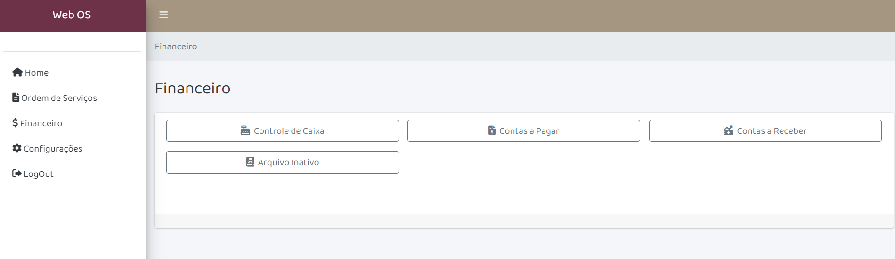

Hello, my name is Grace and I will graduate in Computer Studies at Langara College in 2024.
I fell in love with programming back in 2017 while I was living in Brazil and starting my first graduation at Mechanical Engeneering. Python was my first contact with coding, with which I not only developed my first projects but also decided to be a Teacher Assistant to starting teaching what I loved most.
After that I realize I didn't want to finish that Engeneering degree, instead I would be accomplished pursuing and IT graduation. After a few adjustments on my personal life (and a mundial pandemic from corona virus) I moved to Vancouver, BC - Canada and started to study what I really loved. At each step of this process I'm eager for knowledge and experience, and each day more I love to do that.
Soon I will be an expert, but for now I need a first opportunity as a co-op / intership to start my career. Afterall, there is no study I can do to become a Senior, only experience and effort will bring me that.
Furthermore, count on me be the most proactive, communicative and dedicate person you know. I don't accept less than my best in every activity I do.

Take a look at my [github](https://github.com/gracepbarros) and see some of my repos.

&nbsp;

# PROJECTS

Here are some of my projects.

&nbsp;

### Frogger
A re-criation of 90's Frogger game.

&nbsp;

### Web OS Systemm (ongoing)
System for the client Resolve Locações (Brazil), featuring financial subsystems and a generator of service orders.

&nbsp;

### Mastermind
A game developed using Java that generates a secret number upon starting. Then, provides players with a set number of attempts to guess it. Throughout the game, players receive helpful hints and feedback to help them guess the correct number. There is no front-end system for that project yet.

### Tile Puzzle (ongoing)
A drawing website where you can paint pre-set puzzles and download it.

&nbsp;

# CONTACT

 [https://github.com/gracepbarros](https://github.com/gracepbarros)\
 [https://www.linkedin.com/in/grace-barros](https://www.linkedin.com/in/grace-barros)\
 <a href="mailto:gracepbarros@gmail.com">gracepbarros@gmail.com</a>
